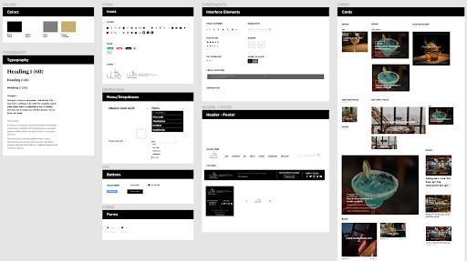
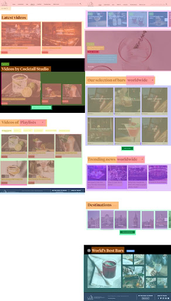

## 2.4. Découpage des maquettes

Cette section est plutôt caduque aujourd'hui où les web designer travaillent avec des outils dédiés comme Figma. Mais l'exercice de découpage des maquettes reste intéressant dans le cas où vous auriez à travailler sur des maquettes sans design system faites sous Photoshop ou autre.

Quand je reçois les maquettes d’un site, la première étape va être de les poser toutes côte à côte et de faire un découpage préliminaire de ce qui constituera les atomes, composants et blocs du site.

Cet exercice a plusieurs intérêts :

- Un tel découpage vous permet de savoir où vous allez, de mieux connaître le site et chacune des pages maquettée ; et d’avoir une vision globale à tout moment;
- Anticiper le plus tôt possible les retours éventuels aux graphistes (voir chapitre suivant);
- Faciliter l’intégration d’un autre développeur sur le projet : si quelqu’un vous rejoint pour s’occuper de l’intégration d’un template, il identifiera rapidement les blocs réutilisé d’autres templates déjà intégrés, les différents composants… et ne développera pas pour son template des éléments qui étaient déjà intégrés ailleurs.

Le découpage peut être assez grossier, L'objectif étant une identification rapide et efficace des éléments. En général je crée des groupes pour les atomes, composants et blocs, j’encadre chaque élément qui revient sur chaque page sur un calque différent, avec chacun une couleur distincte. C’est aussi le bon moment pour donner un nom cohérent à chaque bloc, ou relever certains incohérences entre certains templates.

> Exemples
>
> Sur un site on avait des composants affichant des offres, mais avec différents designs suivant les endroits. En discutant avec le client, on a pu détailler des offres locales, nationales, par lieu, des mises en avant… et améliorer la nomenclature. Sans ce travail préliminaire on aurait peut-être mal nommé les éléments.
> Sur un site institutionnel on avait des contenus gammes, enjeux, solutions, réalisations… Comme vu dans les chapitre précédents il faut définir avec le client à quoi ça correspond, ces noms étant très génériques, et ça doit se retrouver dans la nomenclature de vos éléments dès cette étape avant de les utiliser dans le code.

Si vous êtes en relation avec l’équipe graphique, n’hésitez pas à demander un _design system_ pour avoir les éléments de base entre les couleurs, les icônes, les textes, les composants… Les graphistes avec qui je travaille réalisent les maquettes avec des composants orientés design atomique, ce qui facilite grandement le travail de conception côté front !

_Exemple de design system_

Pour réaliser le découpage je colle un jpeg de tous les écrans sur un document, parfois en réduisant la taille de moitié pour éviter un fichier beaucoup trop lourd. Le but étant d’avoir une vision d’ensemble, ce n’est pas très grave si on n’a pas une qualité optimale.

Je crée une sélection avec tous les éléments similaires (en comptant les variations de couleur si besoin) sur un calque différent pour chaque élément de même type, en commençant par les atomes. En variant les couleurs pour chaque nouveau calque, on peut rapidement identifier les éléments qui se répètent sur plusieurs pages.

_Découpage des éléments de bloc (organismes), nommés et regroupés_

En théorie ce travail n'est plus à faire aujourd'hui compet tenu de l'évolution des outils permettant de travailler en design system. Et avec l'expérience on peut rapidement identifier les éléments répétés. Mais si vous avez à travailler sur des maquettes sans design system, cet exercice peut vous faire gagner beaucoup de temps.
