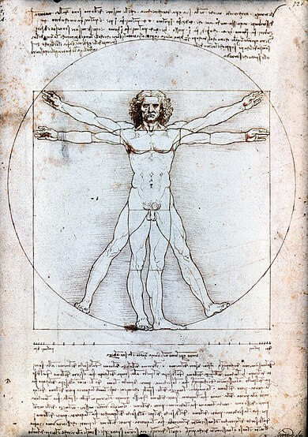
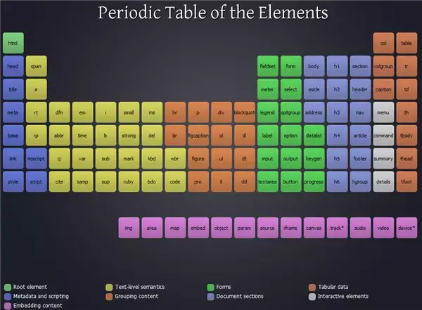

# 2.5. Design atomique

Ce travail préparatoire du découpage des maquettes suit la logique du design atomique, initiée par Brad Frost.

([http://bradfrost.com/blog/post/atomic-web-design/](http://bradfrost.com/blog/post/atomic-web-design/))

Le principe est de ne plus réaliser un site page par page, mais de le penser par composants. Ces dernières années on a de plus en plus cette approche avec React ou Vue, mais le découpage n’est pas toujours bien compris ou réalisé, et on trouve encore beaucoup de duplication de code côté CSS.

Pour avoir réalisé un certain nombre de projets suivant le design atomique, j’ai une approche légèrement différente du découpage:

- les **atomes**, qui sont les plus petits éléments à la base de votre _design system_;
- les **molécules** qui combinent des atomes et éventuellement d’autres molécules;
- les **organismes** que j’associe plutôt à l’ADN qui agrège tout un tas de molécules et les agence correctement;
- le **layout** qui pourrait correspondre aux cellules, gère les variation de mise en page suivant les templates, la composition des blocs dans la page pour séparer correctement et uniformément les différentes sections;
- les pages, qui forment des **individus** entiers et différents mais tous composés d’un ensemble de cellules.

Je retire la notion de templates qui sont des pages avec un contenu neutre, qui font totalement sens dans la [réalisation du styleguide](06-styleguide.md), qui permet de se représenter la page comme l’Homme de Vitruve de Léonard de Vinci, mais qui reste une représentation, pas un véritable individu.

Je remplace cette étape par les “cellules” qui vont composer l’agencement des pages, qu’on détaille plus bas

## 2.5.1. Les atomes / éléments

Dans la Grèce antique, un courant de pensée qu’on associe à Démocrite et Leucippe conçoit qu’en coupant un objet en 2 puis en répétant l’opération autant de fois que nécessaire, on arrive à un moment où on obtient un élément qu’on ne peut plus couper, insécable, atome en grec.

Si on reprend le découpage des maquettes, les atomes sont donc les éléments les plus petits, soit une balise html: un lien, un titre, un champ de formulaire, un label, un bouton… Mais pour un CTA par exemple, on va avoir un lien avec un icone à l'intérieur par exemple. ça reste quand même un atome, puisqu'on ne peut pas le découper en plus petit élément sans perdre de sens. Il reste insécable.

Les atomes doivent dégager la tendance globale des éléments de typographie, des titres, boutons, éléments de formulaire, liens...

> Tout comme en physique on peut finalement aller plus bas qu'un atome avec les quarks, gluons et autres joyeusetés, on peut aller un peu plus loin avec les pseudo-éléments (::before, ::after), les états (:hover, :focus…), le shadow DOM.
> Et pour en finir avec le parallèle avec la physique, là où les atomes sont classifiés dans le tableau périodique des éléments de Mendeleiev, on peut faire une classification des éléments HTML, comme celle proposée par Josh Duck (http://smm.zoomquiet.top/data/20110511083224/index.html).

## 2.5.2. Les molécules / composants

Viennent ensuite les composants, qui vont utiliser des éléments du layout, et parfois d’autres composants à l’intérieur. Par exemple sur les maquettes vues précédemments, sur un composant “_Video teaser_”, on avait un composant “_Video timer_” à l’intérieur. J’aime bien ce nommage de “teaser” comme en Drupal pour un élément en mode aperçu, qu’on va généralement retrouver en liste dans un bloc.

> Quand j'ai commencé le design atomique, j'avais du mal à identifier la limite entre ce qu'était un bloc ou un composant. Pour ma part je considère qu'un composant peut être composé de plusieurs atomes, mais également d'autres composants. Tout comme l'ADN est une succession de nucléotides composé de 3 molécules à chaque fois, on peut assembler plusieurs composants comme on le souhaite pour former un seul organisme.
> C'est pour ça que video teaser est un composant qui contient lui même un composant video timer à l'intérieur, et je considère la liste comme un organisme.
> Un composant/molécule peut donc inclure d'autres composants et pas uniquement des atomes, afin d'offrir une meilleure hiérarchie dans l'imbrication des éléments. Le video teaser est ainsi un composant indépendant qui se répète dans un organisme.

## 2.5.3. Les organismes / blocs

Justement, parlons des organismes. On pourrait également parler de bloc : Ils englobent des composants, et font généralement toute la largeur de la page – ou du moins de leur section, suivant ce qui définit le layout de votre template, mais on voit ça juste après.

J’ai déjà évoqué ce point dans la partie sur le découpage des maquettes, mais si on a bien découpé ses composants indépendamment des organismes, on peut avoir un organisme avec un composant répété en liste sur une ligne, affiché en quinconce, ou bien un carrousel de ce même composant.

C’est l’organisme qui va définir comment les composants sont agencés à l’intérieur, les espacements entre eux sur les différents terminaux. Et c’est normalement son seul rôle. Il ne redéfinit qu’exceptionnellement les propriétés de police ou de couleurs à l’intérieur du composant.

Une des erreurs à éviter est le surdécoupage. Pour des sites assez simple comme des sites vitrine, ou chaque bloc est bien identifié et différent, je vais souvent avoir une molécule pour l'intro (vu qu'on a très souvent surtitre/titre/texte), mais le reste du contenu sera fait directement dans l'organisme, plutôt que créer uen molécule qui sera incluse dans un seul organisme. Dès qu'on a un composant qui se répète dans plusieurs organismes, il faut le sortir dans une molécule.

## 2.5.4. Les cellules / sections

Si vous avez lu les présentations du design atomique et que vous suivez bien, normalement on devrait être à la partie concernant les templates…

Mais selon moi il manque une étape dans le design atomique, celle qui définit le gabarit général des sections de vos templates. Ca pourrait être comparé à des cellules qui englobent nos organismes, et se spécialisent dans un affichage donné.

Si on reprend les maquettes découpées, les blocs qui contiennent une liste de composants sont indépendants, mais sur les créas, on a une structure avec une bloc avec un fond blanc ou noir contenant un titre et un bloc.

Il faut réfléchir à la structure de chaque partie du site:

- comment gérer les éléments dans un bloc de couleur différente (changer la couleur des textes et du titre dans un bloc noir);
- comment gérer l’espacement entre les blocs et sections, qu’il faut généralement uniformiser. Les graphistes peuvent utiliser des grilles pour uniformiser les dimensions et espaces horizontalement, mais verticalement les espaces avant et après les éléments sont assez compliqués à faire exactement partout pareil sur les créas. Idéalement il faut utiliser des variables pour avoir le même espacement entre chaque blocs ou éléments, afin d’harmoniser le rendu des pages;
- comment gérer la largeur des sections. On retrouve souvent des blocs en haut ou bas de page qui font la largeur totale de la page. Puis certains contenu avec une largeur conséquente pour afficher une liste d’éléments, mais limitée passée une certaine largeur; et d’autres contenus comme les textes avec une largeur moindre pour faciliter la lecture en évitant des lignes trop longues;
- comment afficher des blocs sur plusieurs colonnes avec le bon espacement, un “aside” avec des filtres ou des contenus annexes sur certaines pages, à côté du contenu principal.

Elle donne lieu à des variables dans votre css pour définir l’espacement entre les blocs, les gouttières de chaque côté de l’écran, ou encore la largeur maximale de chaque type de contenu.

> En pratique voici l'exemple d'un site que j'ai développé pour [Pénélope](https://penelope.fr/).
> Mes sections sont dans un l-blockWrapper _(l pour layout)_ qui défini l'espace entre les blocs verticalement. Chaque bloc a une variante -light ou -dark pour ne pas dupliquer la marge quand 2 blocs de même couleur se suivent.
> Et à l'intérieur un div l-blockContent avec des variantes -small, -medium, -large... pour tous les types de largeur de blocs. comme ça on reste uniforme sur tous les blocs, qui n'ont pas à porter individuellement ces information.
> si certaines pages ont une colonne en plus pour des filtres par exemple, je défini un l-aside pour la structure du template qui peut être utilisé sur toutes les pages qui en ont besoin.

## 2.5.5. Les individus / pages

Je regroupe la partie template et page du design atomique classique puisqu’ils contiennent tous les deux les même cellules, organismes, molécules et atomes qui constituent le rendu final. La distinction entre template et page vient du contexte: le template prend tout son sens dans un styleguide, puisque le contenu est pris en dehors de tout contexte, n’est pas porteur de sens, et les images seront des placeholders. Mais on reparle de tout ça dans la section _styleguide_ de ce livre.

La page quant à elle, va être représentative du contenu final, ce que voudra voir votre client. Elle est contextualisée, avec des vraies images et des contenus variables.

Mais généralement les maquettes sur lesquelles on se base pour l’intégration sont déjà contextualisées, la partie template fait moins de sens avec les outils d’aujourd’hui.

## 2.5.6. Organiser son développement en design atomique

En terme d’organisation la conception prendra forcément un peu de temps pour découper les maquettes, identifier les différents éléments composants le site, mais ce temps sera largement compensé par la suite.

Généralement le client voudra découper son site en différents “lots”, correspondants à des pages du site. Alors que côté front, on va découper chaque page en composants ou blocs. Il conviendra de développer en premier les composants des premières pages demandées en priorité, et prévenir qu’on peut passer plus de temps sur les premières pages, mais que les suivantes iront potentiellement plus vite à réaliser, puisqu’elles réutiliseront des éléments déjà créés.

Un point important également, c’est qu’on commence très souvent par développer la page d’accueil. Et c’est très souvent la page la plus spécifique du site, avec une mise en avant particulière de certains éléments pour renvoyer vers les différentes sections. Il n’est pas rare que les titres ou les textes soient légèrement différents des autres pages du site. Ce qui fait qu’on va commencer par développer des éléments qu’on considérera génériques pour la réalisation des autres pages, alors que c’est ce contenu qui est spécifique. Le découpage des maquettes en amont ainsi que l’approche atomique du design permettent d’éviter ce genre d’erreur de conception.

Si on devait résumer le rôle de chaque partie du design atomique, on aurait:

1. les atomes qui définissent des éléments unitaires, comme textes, titres, boutons, liens, éléments de formulaire…
2. les molécules qui sont un agrégat d’atomes avec toute la mise en forme nécessaire, qui sont les plus petits et réutilisables possibles;
3. les organisemes qui disposent les composants correctement;
4. les cellules qui définissent la structure générale de vos page avec la largeur maximale des blocs et l’espacement entre chaque bloc;
5. l’individu qui représente le contenu dans son ensemble.

> Depuis que je conçois des sites en suivant le design atomique avec des composants facilement réutilisable, j'interviens assez rarement après la mise en ligne d'un site pour faire les évolutions. Généralement le développeur qui va créer de nouvelles pages d'aura qu'à réutiliser des composants et blocs d'autres pages et les agencer différemment sur de nouveaux templates. Il aura tous les éléments à sa disposition, et juste à les imbriquer comme il le souhaite.
