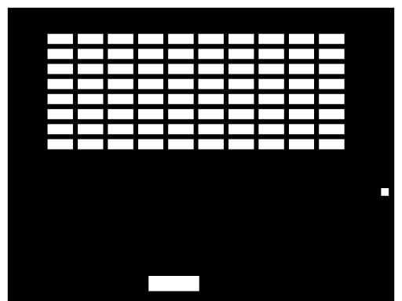
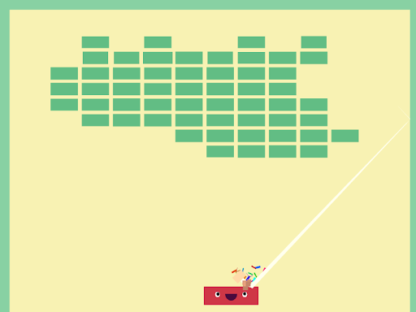

## 2.1. Signs & Feedbacks

### 2.1.1. Dans les jeux vidéos

Selon Marc Albinet – Game director sur Assassin’s Creed : Unity, auteur de \_Concevoir un jeu vidéo – les signes et les feedbacks sont des indicateurs de gameplay et de compréhension doublés d’un outil de mise en scène. On va détailler ça.

Un **signe**, c’est ce qui montre la possibilité de faire une action, ou attire l’attention du joueur sur ce qu’il peut faire ou ce qui va se produire:

- Un halo rouge apparaît autour d’un personnage pour indiquer que c’est un ennemi, ou vert si on peut interagir avec;
- Un bouton se grise quand une action n’est pas possible ou est lumineux si on peut utiliser son effet;
- Un bouton apparaît pour signaler un QTE (Quick Time Event, action contextuelle que le joueur doit réaliser dans un cours laps de temps pour réussir et passer à la suite).

Pour être réussi, un signe doit:

- Être suffisamment perceptible pour qu’on sache bien quelle action on peut faire ou pas;
- Sans ambiguïté, pour ne pas pouvoir confondre une action possible avec une autre.

Un **feedback**, c’est un retour qui informe le joueur qu’une action vient de se passer. Il peut être visuel, tactile, sonore. Par exemple dans un jeu de tir quand un joueur vient de se prendre un impact:

- la manette vibre;
- L’image à l’écran vibre;
- Les bords de l’écran deviennent rouge;
- Le personnage émet un cri;
- La barre de vie diminue, avec un clignotement pendant quelques secondes;
- L’indicateur du nombre de points de vie change avec un grossissement temporaire…

Pour être réussi, le feedback d’une action doit:

- Avoir lieu immédiatement après l’action;
- Être en rapport direct avec cette action;
- Être suffisamment perceptible pour qu’on sache bien que l’action s’est déroulée;
- Sans ambiguïté, pour ne pas pouvoir confondre le feedback d’une action avec celui d’une autre.

Les 2 derniers points sont les mêmes que pour les signes, si vous avez bien suivi.

Il faut bien sûr doser les feedbacks par rapport à l’action qui vient de se dérouler pour qu’on en ressente l’impact, d’où la définition qui indique un outil de mise en scène. Quand on blesse un ennemi dans un jeu on a plusieurs feedbacks sonores et visuels à l’impact, et lorsqu’on lui met le coup fatal il y a davantage de retours (un cri plus long, un score qui augmente, une explosion de l’ennemi…); et encore plus lorsqu’on va achever un boss de niveau, avec un ralenti sur la dernière action par exemple.

Si une action basique a un effet disproportionné par rapport à l’action réalisée, le joueur pourra sortir de l’action. C’est parfois le problème rencontré avec les QTE (Quick Time Event), où le joueur doit juste appuyer sur un bouton à un moment donné pour continuer l’action scriptée.

Le feedback sert à hiérarchiser l’action selon l’importance qu’on veut lui donner, et suivant ce qu’on veut lui faire ressentir.

### 2.1.2. Sur le web

Sur le web, généralement les liens sont soulignés, et d’une autre couleur que le texte. L’utilisateur sait alors qu’il peut cliquer dessus. C’est un des signes les plus courant. Les liens bleu soulignés sont là depuis… bien longtemps! C’était déjà comme ça à l’époque des premiers navigateurs Internet Explorer et sous Nescape !

On a très souvent des liens qui sont des boutons, avec un fond bien visible, ou une bordure, et une taille conséquente par rapport à un simple texte. On hiérarchise ainsi l’importance de différents signes. Un exemple assez marquant concerne des emails. Il y a plusieurs années j’avais intégré un email basique avec une grosse image entièrement cliquable, avec sur cette image un bouton. Bien que le curseur de la souris indique que tout était cliquable, les statistiques étaient sans appel: plus de 90% des utilisateurs cliquaient sur l’image à l’endroit du bouton.

Il faut toujours indiquer qu’une action est possible avec un effet de survol et une modification du curseur, afin de montrer à l’utilisateur qu’il peut interagir avec.

- On grise un bouton désactivé, on met le curseur disabled, on ajoute une tooltip pour indiquer que l’action n’est pas possible et pourquoi lorsque l’utilisateur survole le bouton;
- Sur une galerie d’image permettant de visualiser les images en plein écran on met le curseur zoom-in pour indiquer l’action que peut faire l’utilisateur…

Dès qu’une action va prendre un certain temps, comme avec un appel ajax, il faut multiplier les feedbacks:

- Bloquer son bouton quand l’action est en cours (le griser ou le rendre moins visible légèrement en général).
- Mettre le curseur \_progress \_ou \_wait \_pour indiquer l’état de chargement;
- Ajouter un loader sur la page, même s’il est en haut dans un coin, l’œil le percevra; et/ou sur le bouton qui a initié l’action;
- Une fois le contenu chargé: afficher un message que l’action s’est bien réalisée, masquer le loader, scroller jusqu’au contenu ajouté, ajouter un effet de highlight temporairement pour montrer ce qui a changé sur la page...

Si l’utilisateur clique quelque part et qu’il n’a pas d’effet immédiat, il va cliquer plusieurs fois, et souvent ce n’est pas ce qu’on veut. C’est d’autant plus vrai sur les applications mobile, avec des débits parfois réduits lents.

Si rien ne se passe quand l’utilisateur déclenche une action, il va juste arrêter d’utiliser l’application en pensant qu’elle n’est pas réactive. Si vous ajoutez une petite transition entre l’état initial et l’état de chargement, le chargement se lançant en arrière plan le temps que la transition se fasse, l’attente paraîtra moins longue à l’utilisateur du fait de cette animation.

### 2.1.3. Interactions “Juicy”

En game design, le terme “Juicy” désigne “le sentiment satisfaisant que nous obtenons lorsque l’énergie potentielle est convertie en énergie cinétique”.

Une conférence de Martin Jonasson sur le thème “Juice it or lose it”, explique un peu mieux ce concept. Ils prennent pour exemple un casse brique tout simple, sans couleur ni feedback particulier. C’est jouable, mais on ne ressent pas vraiment de fun. Puis ils ajoutent des effets au fur et à mesure pour arriver à une application complète:

- Un effet d’apparition au lancement du jeux;
- Des couleurs plus variées pour les briques;
- Lorsque la balle rebondit sur un mur elle va légèrement s’écraser pour insister sur l’impact. Il va y avoir un jet de particules, un son spécifique, une trainée qui va suivre le déplacement...
- Lorsque le joueur déplace la barre elle s’étire légèrement le temps de l’animation. Ils lui ajoutent des yeux et des animations pour ajouter de la personnalité;
- Quand une brique est touchée, elle va disparaître avec une animation comme projetée par la violence de l’impact de la balle;
- A chaque rebond l’écran va légèrement vibrer, effet qui s’intensifie quand le joueur réalise un combo et casse plusieurs briques avant que la balle ne redescende…

Je n’ai pas listé toutes les possibilités, au final c’est plus d’une trentaine de paramètres qui peuvent être réglés depuis leur démo.

Il ne faut pas abuser de tous ces effets non plus et trouver le juste milieu pour ne pas noyer l’utilisateur, sans oublier les règles des feedbacks vues précédemment. Le but étant de hiérarchiser l’impact d’une action par rapport à une autre.

Sur le web, les actions manquent souvent de feedback. On en aura jamais autant que dans le jeu vidéo bien sûr, mais j’espère que ces exemples vous permettront de mieux concevoir les actions possibles et les réponses à vos utilisateurs, et d’ajouter un peu plus de fantaisie quand c’est possible avec des animations adaptées pour un web plus interactif et des pages moins statiques. \

Lien du jeu pour tester les interactions juicy: [http://grapefrukt.com/f/games/juicy-breakout/](http://grapefrukt.com/f/games/juicy-breakout/)
